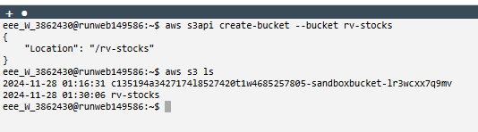
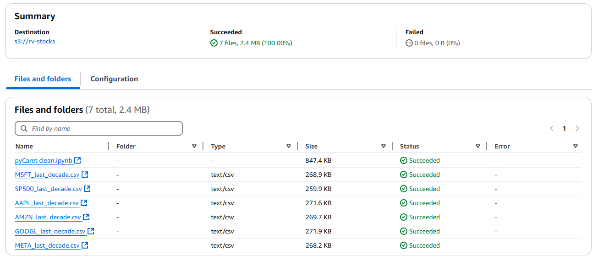

# AWS

### Create a bucket

I created an S3 bucket in the aws terminal.

Then I had to load my data into the bucket so I could later access my datasets and models.

### JupyterLab

In the lab I grabbed my SP500 dataset and the pycaret notebook from my bucket so I could run the model inside of SageMaker.

This is the overview of what the environment looked like after importing all the necessary files and running my model.

## Adaptations for AWS

In the notebook included in this directory are some changes I had to make in order for everything to work in the AWS environment.

Most of the dependancies came pre-installed in SageMaker however pyCaret did not. During the installation of pyCaret some issues showed up which i managed to resolve by using the following command that was recommended to me during the installation.

`!pip install --use-pep517 pycaret`

Furthermore I had to change the file path to the path where I stored my dataset, since I decided to download my dataset into the jupyterLab environment (because it's very small) I only had to adjust the path slightly.

`csv_filename = './SP500_last_decade.csv'
`
