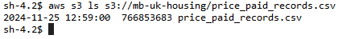

# Using AWS

## Warning
I had to change the file type of the original data to .parquet because AWS environment had issues loading the original .csv file.

## Tasks performed on AWS
I created a bucket to store all my data. It is located at `/mb-uk-housing`.:

`aws s3api create-bucket --bucket mb-uk-housing`

I downloaded the data using wget:

`wget https://www.kaggle.com/api/v1/datasets/download/hm-land-registry/uk-housing-prices-paid/price_paid_records.csv`

`aws s3 cp price_paid_records.parquet s3://mb-uk-housing/`

For the python notebooks, aws uses `conda_python3` kernal. To install all the ncessery dependencies, I used this command:

`conda install pyarrow pandas matplotlib seaborn pycaret`.

I ran code from `final_cleaning.ipynb` to create the necessery datasets to train the models.

Afterwords, I created models ....

