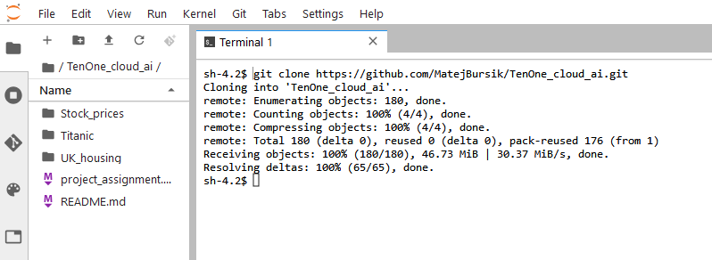

# Using AWS

## Warning
I had to change the file type of the original data to .parquet because AWS environment had issues loading the original .csv file.

## Tasks performed on AWS
#### Working with data
I created a bucket to store all my data:

Since I had issues using the original .csv file, I imported a .parquet version of that file. But the original file can by downloaded by using wget:

`wget https://www.kaggle.com/api/v1/datasets/download/hm-land-registry/uk-housing-prices-paid/price_paid_records.csv`

AWS contains an environment for running Jupyter notebooks called SageMaker. In order to work with my datasets and make model, I used this command to install all the python dependencies I needed:

`pip install --use-pep517 pyarrow pandas matplotlib seaborn pycaret`

I clone our GitHub repository to access all the Jupyter notebook easily.

Then, I ran the code from `final_cleaning.ipynb` to create the necessery datasets to train the models.

Copy the file into a bucket:

`aws s3 cp *file name* s3://mb-uk-housing/`

#### Making models
I opted for using pycaret for the prediction model which I mostly ran on AWS due to local hardware limitations.

I imported the dataset the bucket into SageMaker and into the notebook. Then, I ran a `setup` function to prepare the dataset for pycaret.

Afterwards, I ran a function `compare_models` which runs a quick evaluation of the models compared to the dataset. I head little issues with this function because the large dataset kept crashing the conda_python3 kernal.

I tryied runnnig it several time with similar results. So I decided to limit which model it can compare. I chose these models because during those attempts they alway ended towards the top of the chart.

When it finally worked, I ran a function `tune_model` which optimizes the hyperparameters of the model. In the same code block I run an evalation and prediction of the model.

Optimizing hyperparameters

Then few issues occured during the `tune_model` function so at the end, I had to swap to a Linear Regression model which was faster to optimize its hyperparameters and here is its evaluation.

Model evaluation

