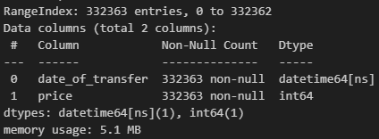
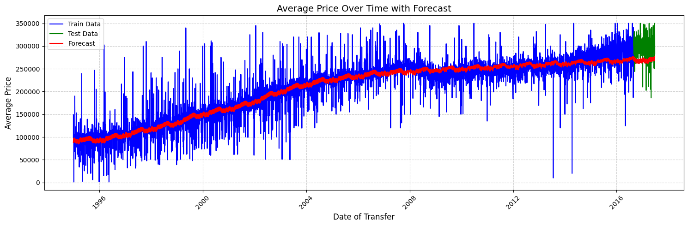

# Models
I started with the basics, so I aimed to predict the price of a property based on certain varaibles like date_of_transfer, property_type, is_new, duration, city, district, county, and ppdcategory_type.

## Prediction model

## Forcasting model
I got inspired by the Stock_prices part of the project to make a forecasting model. I aimed to forecast the price of Terraced (property_type = T) properties in London (city = LONDON).

#### Prophet Model
Prophet is a forecasting tool developed by Facebook designed for time series data that exhibits trends and seasonality. It is robust to missing data and outliers, and it can handle non-linear trends by incorporating seasonality, holidays, and other custom components. Prophet is well-suited for business and research scenarios requiring interpretable and reliable forecasts.

Workflow with Prophet:
1) Prepare data with columns ds (date) and y (value to forecast)
2) Fit the model with your dataset
3) Generate future dates/period for which you are planning to forecast
4) Forecast values

#### Dataset
I created 4 bar charts to displaythe number of transactions in cities. Each chart showed different property type excluding 'other'. Based on that charts, I decided to create a dataset containing the date of the transaction ('date_of_transfer') and price for Terraced (property_type = T) properties in London (city = LONDON).

[See more...](../forecasting_data.ipynb)

#### Results

- Blue line represents all the data that the model was trained on.
- Green line represents data that was hidden from the model. It is the values from the last 300 days of the complete dataset.
- Red line represents the data forecasted by the model.
